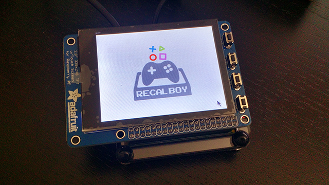
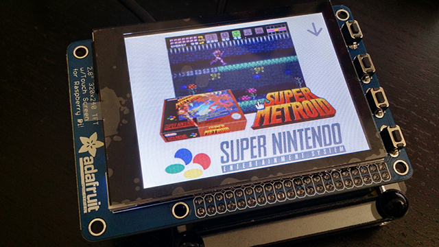
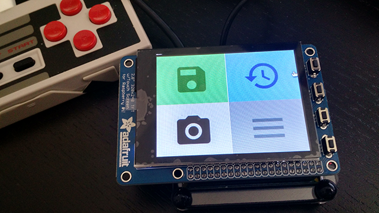

Recalboy is your "1-click" companion for [Recalbox](http://www.recalbox.com) and is powered by the micro-framework [Lumen](http://lumen.laravel.com).

I made it for a personal project, to provide a [little second screen](public/assets/img/readme/gba_recalboy.png) for an arcade cabinet, to get access to main features of Retroarch in a breeze. 

* Save
* Load last save state
* Take a screenshot & upload it in the cloud
* Open/Close Retroarch menu
* Reset game
* Exit game

**New in v0.3** ! You can manage backups of your saves files !

* Say goodbye to corrupted saves, never lose your progress anymore !
* Recalboy automatically backups your latest saves when you exit a game.
* Browse and search your backups by system/game/date/hour, and restore them one by one to your Recalbox.
* Coming soon : download your backups in 1 zip file.


**New in v0.2** ! There's a perfect tool for your arcade cab': **Demo Mode** 

* Launch randomly a game from the systems of your choice.
* Every X minutes, another game is launched.
* You want to play to what you see? No problem: just start to play, Demo mode will turn off.
* You don't like what you see? Press Hotkey to skip and launch another game.

**Demo Mode** is perfect to discover games from your collection, or just to let your Recalbox powered arcade cabinet turned on, to display demos like a true arcade cabinet!


----------
# How to install ?

See **Requirements** and **Easy Install Wizard** blow, after **Demo & screenshots** section.

> Note: Recalboy is **not** something you install on Recalbox.

----------


# Demo & screenshots

Watch a demo of v0.2.0 on [on Youtube](<https://youtu.be/53zNutFFCbk>).

You can watch a demo of an early version [here](<https://youtu.be/k_k3ho4qGwg>).

Screenshots of release [0.1.2](<https://github.com/kjbstar/recalboy/releases/tag/v0.1.2>) with "micro" theme, on my 2.8" piTFT screen:

### Default view, waiting for a game


### Game detected !


Click on the upper-right arrow to instantly scroll to actions buttons.
### Four of the six actions buttons


Reset and Exit buttons are under these buttons, to avoid to press them by mistake :)

----------

# Requirements

* A local server (on a Raspberry with Raspbian, for example).
* Or a Virtual Machine with Debian or Ubuntu.
* Any modern browser on client side (Chrome, Chromium, Firefox...)

My installation is done on a Raspberry Pi Zero. In this case, I suggest you to temporary increase swap memory to avoid any memory issue during installation. [Read more](http://raspberrypi.stackexchange.com/questions/70/how-to-set-up-swap-space).

You can install on another OS, but Recalboy has been tested only on Debian 8, Ubuntu Server 17.04, and Raspbian. You may have to do manual install on another OS.

> Virtual Machine users : I suggest you to configure your network on Bridge Access, so that your VM will get its own local IP. Just select "Bridged Adapter" in [Network configuration](public/assets/img/readme/bridged_network.png) (4th choice).

# Easy Install Wizard

Recalboy is very simple to install.

* Connect to the machine where you will install Recalboy through `ssh`
* Then enter the following command, to download and execute the Install file.

```
wget https://raw.githubusercontent.com/kjbstar/recalboy/master/install.sh && chmod +x install.sh && sudo ./install.sh
```
> Yes, you have to execute this command with `sudo`.
> You can check the file by yourself, there's nothing dangerous :)

The Wizard will guide you through 4 steps:

 1. Install requirements: mainly Apache 2 and PHP
 2. Virtual Host setup
 3. Composer install
 4. Recalboy install

On a freshly installed OS, or if you don't know what to answer, you would answer all questions just by pressing `Enter` key on your keyboard. Be careful: the last question expect you to enter your Recalbox's IP :)

> **Advanced users**: please note that the Wizard will stop if you choose to customize the path of Recalboy's VirtualHost. Manual install is still possible, though.


Bravo ! Recalboy is now installed, you should be able to access it by your server's local IP (usually `http://192.168.0.X`, or by `http://recalboy.local` if you modify the `hosts` file of your client machine. But access by IP is fine :)


# Configuration

Please first visit `http://recalboy.local/config/recalboy` to finish configuration.
It's not mandatory, but higly advised if you plan to use Demo Mode :)

> Don't fear to make a mistake in configuration file: a backup is made each time you save from this page. There's a link to access the History, and you can Rollback in 1 click.

### About Retroarch's Networks Commands

They **MUST** be activated to make Recalboy working with your Recalbox.

**Don't worry, the Easy Install Wizard has already activated them.**
If you have any doubts, you can open:
`http://recalboy.local/config/check/retroarch/networkcommands`
in your browser.

> **Advanced users: do you have any custom retroarch configurations ?** Then you must enable network commands in the Retroarch settings menu, or ensure that `network_cmd_enable = "true"` is set in your custom config file.

#### Recalbox configuration : IP, SSH login and password
`RECALBOX_IP` - put here your Recalbox local IP. IF you have run the Easy Install Wizard, it is already set.

`RECALBOX_LOGIN` and `RECALBOX_LOGIN` are already set with default Recalbox values for SSH access.

#### Main Recalboy configuration: auto check if a game is running, or manual check by clicking the logo
`REFRESH_AUTO` - Available values: `1` or `0` - Default: `1` (enabled)

`REFRESH_DELAY` - Default: `10` (check every 10 seconds)

`THEME` - Default: `classic`

#### Configure Screenshots upload
`UPLOAD_SCREENSHOTS` - Default: `0` (disabled, set `1` to enable)

`UPLOAD_METHOD` - Set here your favorite storage solution to upload automatically your screenshots. Available methods: `Amazon S3`, `Google Drive`, `Dropbox` (64-bits architecture only, not fully tested).

`RECALBOX_SCREENSHOTS_PATH` - Default: `/recalbox/share/screenshots` It's screenshots path on Recalbox side !

`REMOTE_PATH` - Where you will upload your screenshots on your remote storage solution.

You then have options to set the keys of your storage solution.

#### Configure Demo Mode
`DEMO_SYSTEMS` - Put here the Systems you want to see when using Demo Mode. Recalboy will randomly pick a game from on of these systems. Example: `mame,snes,n64`.  Default: `nes` 

`DEMO_VOLDOWN` - Volume when a game is running in Demo Mode.  Default: `0` 

`DEMO_VOLUP` - Volume when you exit Demo Mode.  Default: `90` 

`DEMO_DURATION` - Running time of each game in Demo Mode, in seconds.  Default: `300` 

----------

# How to use Recalboy ?

Just open it in your browser :)

To launch Demo Mode, click on the upper-right `"Play" icon`.
To skip a game during Demo Mode, press `Hotkey` button.
To quit Demo Mode, press `Hotkey` button or click on Recaloby's `Exit` icon.
Demo mode can detect if you start to play a game and stop by itself. Yes.

If there's any problem, just refresh your page.

> **Note**: It only works with scraped games :)

----------

# Known Limitations
Sadly, as Recalboy use Retroarch Network Commands, keep in mind that the following systems are (still) not supported :

* Dosbox
* Pifba
* Kodi (obviously!)
* LinApple
* Moonlight
* Mupen64 (N64)
* PPSSPP (PSP)
* Reicast (Dreamcast)
* Scummvm
* Vice (Commodore)
* Dolphin
* AdvanceMame

Other limitations:

* In Demo Mode, launching a new game may be a bit slow, up to 40 seconds for first launch on my Raspberry Pi Zero.
* Don't use to lower values for `DEMO_DURATION` and `REFRESH_DELAY`. It may causes weird behaviors in Demo Mode.
* **Known issue**: After using Demo Mode, you can launch a game with ES only 1 time. After, games exit with exit code 13, so you have to reboot Recalbox (or re-launch Demo mode). It's weird, I don't understand why...

# TODO

* Add more informations from running games, to get something less basic.
* Re-arrange Classic and Mini themes.
* Demo mode: find a better way to handle Emulation Station off/on.
* Arcade games : finding, adding, and managing the display of instructions card / move lists, to never forget how to make a Hadoken :) 

## Thanks to

* [Recalbox Community](https://forum.recalbox.com/).
* [Cute File Browser](https://tutorialzine.com/2014/09/cute-file-browser-jquery-ajax-php): used (customised) for browsing backups.

## License
Recalboy is open-sourced software licensed under the MIT license.
Feel free to fork it and improve it. Keep in mind I don't consider myself as a developer, so don't be too rough with my code :)